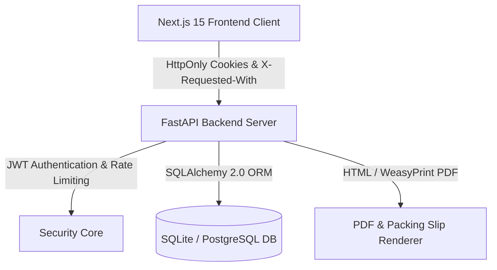

# FreshFlow System Architecture & Database Schema

This document outlines the system data flows, database schemas, and relationship models for **FreshFlow**.

---

## 1. System High-Level Data Flow

---

## 2. Key Database Entities & Relationships

- **`User`**: Core authentication entity (`id`, `email`, `password_hash`, `role` (`ADMIN` | `CUSTOMER`), `is_active`).
- **`RefreshToken`**: Session revocation tracking (`id`, `user_id`, `token_hash`, `expires_at`, `revoked_at`).
- **`Customer`**: Wholesale buyer profile (`id`, `user_id`, `restaurant_name`, `address`, `phone`, `gstin`, `credit_limit`, `payment_terms_days`).
- **`Product`**: Produce catalog item (`id`, `name`, `category`, `unit`, `default_price`, `is_active`).
- **`CustomerProduct`**: Negotiated price overrides (`id`, `customer_id`, `product_id`, `custom_price`).
- **`Order`**: Procurement order (`id`, `customer_id`, `request_id` (unique), `status`, `payment_status`, `remarks`).
- **`OrderItem`**: Order line items (`id`, `order_id`, `product_id`, `quantity`, `unit`, `unit_price`).
- **`Supplier`**: Wholesale vendor (`id`, `name`, `contact_name`, `phone`, `email`).
- **`PurchaseOrder`**: Vendor procurement order (`id`, `supplier_id`, `status`, `total_amount`).
- **`Invoice`**: B2B invoice (`id`, `invoice_number`, `order_id`, `customer_id`, `status`, `subtotal`, `tax_amount`, `total_amount`).

---

## 3. Query Efficiency Principles

- **Single Relations**: Always fetch using `joinedload` (e.g. `Order.customer`, `Invoice.customer`).
- **Collection Relations**: Always fetch using `selectinload` (e.g. `Order.items`, `Invoice.items`, `Order.files`) to eliminate Cartesian product expansion and N+1 query bottlenecks.
